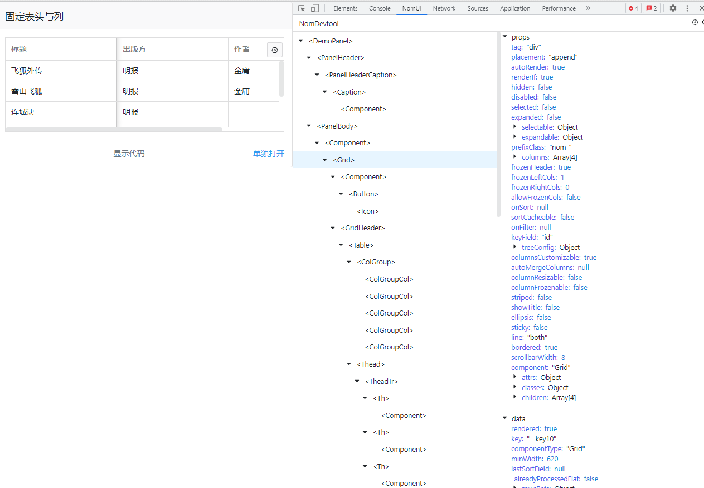

# nom-devtools

nom-devtools 是支持[nomui](https://github.com/nomui/nomui)组件库的 chrome 调试工具，能解析 dom 树，得到对应的组件树。更清晰的展示所选组件的 props,data,methods 等数据




## chrome devtools 简单介绍

### 项目目录

整体思路

- dist 为插件最终打包目录
- dist/panel.js, dist/get-inst.js 为 src 中的 panel 目录和 instant 目录，由 gulp 打包生成
- dist/panel.js 负责控制 devtools 中的展示和交互
- dist/get-inst.js 负责 dom 中的交互(高亮节点，读取 dom 元素等)

注：_在 panel 中无法操作页面的 dom, get-inst 无法操作 devtools 中的 dom。二者通过 window.postMessage 通信_

_get-inst 能获取的页面 dom 是因为在`manifest.json`中配置了 `web_accessible_resources`_

```
NomUI_devtools
├─ dist // 最终插件安装目录
│  ├─ background.js // 将content中的 message发送到devtools中
│  ├─ css
│  │  └─ nomui.css
│  ├─ devtools.html
│  ├─ img
│  │  ├─ icon128.png
│  │  ├─ icon16.png
│  │  └─ icon48.png
│  ├─ js
│  │  ├─ content.js // 只有在content中调用 chrome.runtime.sendMessage 通知到 background中
│  │  ├─ detector.js // 判断nomui是否存在,同时更新popup
│  │  ├─ devtools.js // 创建panel, 并将通信通知到panel中
│  │  └─ nomui.js
│  ├─ manifest.json // 插件配置文件
│  ├─ panel.html
│  └─ popups
│     ├─ enabled.html
│     └─ not-found.html
├─ gulpfile.js // gulp配置文件, 打包panel.js 和 get-inst.js
├─ media
│  └─ screenshot.png
├─ readme.md
├─ script
│  └─ compile-prettier.js // gulpfile中使用,打包时优化
└─ src
   ├─ instance
   │  ├─ component-picker.js // 点击Panel中的foces图标后，给dom页面添加mouseover事件
   │  ├─ highlighter.js // 高亮部分
   │  ├─ index.js // 初始化获取组件树和监听从panel中传出的事件
   │  └─ JobQueue.js // 事件队列
   ├─ panel
   │  ├─ helper.js // 右侧数据展示的生成
   │  └─ index.js // panel面板（组件树和其props等数据的展示）
   └─ utils.js // 公用方法和函数（从dom中解析出组件树）

```

### 数据流

1. `devtools.js`: 判断是否存在 window.nomui，存在则`createPanels`，此时连接上 background.js 并与其保持通信链接

```javascript
// 1.与后台网页消息通信-长连接
const port = chrome.runtime.connect({ name: 'devtools' })

// 2.搭桥: 此步骤后，调动 background的即可通知到当前 devtools中
port.postMessage({
  tabId: chrome.devtools.inspectedWindow.tabId,
  name: 'original',
})

// 3.监听来自页面中的事件，content-sctipt background devtool
port.onMessage.addListener((message) => {
  if (_window && _window.contentScriptReceiver) {
    _window.contentScriptReceiver(message)
  } else {
    contentScriptData.push(message)
  }
})
```

2. `background.js`: 其中对 chrome.runtime.onMessage 进行了监听，并将其事件转发到对应链接的 devtools 中

```javascript
if (tabId in connections) {
  connections[tabId].postMessage(message)
} else {
  console.log('Tab not found in connection list.')
}
```

3. `content.js`: 注入`detector.js`和`get-inst.js`，并将 message 信息发送到`background`中。**所有的需往后台通知的信息，都需通过 content.js 调用 chrome.runtime.sendMessage 发出**

4.`panel.js`: 其中通过 `chrome.devtools.inspectedWindow.eval`来调用 `window.postMessage`

```javascript
onmouseleave() {
  chrome.devtools.inspectedWindow.eval(
    `
    window.postMessage({
      name: 'TO_BACK_COMPONENT_MOUSE_LEAVE',
      payload: {}
    })
    `
  );
},
```

## 待优化

- get-inst.js中使用到的变量都是全局作用于
- postMessage中的name需加上nom_devtools的前缀标识，且用常量统一管理
- panel面板中的控制左右宽度
- panel面板中的查询过滤（tree子节点或右侧state的值）
- 当前只在初始化遍历时，获取了组件树的数据，需加上dom中子组件后，再对panel中tree的部分更新（需要修改nomui实现）


## 参考
- [vuejs/devtools](https://github.com/vuejs/devtools)
- [ec-devtools](https://github.com/HuJiaoHJ/ec-devtools.git)
